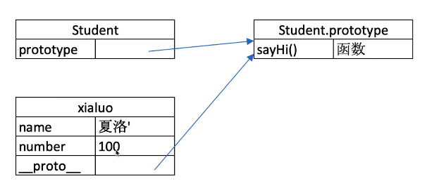
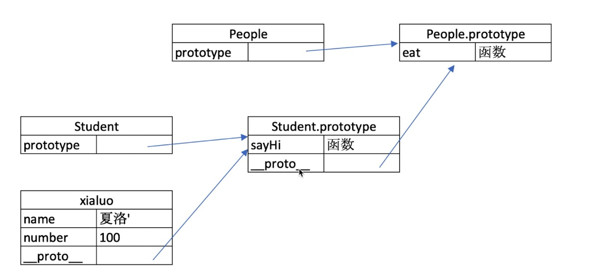

## 知识点
#### class 和继承（5-1）
##### constructor
```HTML
<script type="text/javascript">
class Student{
    constructor(name,number){
        this.name = name;
        this.number = number;
    }
    sayHi(){
        console.log(
            `姓名 $(this.name).学号 $(this.number)`//es6语法
        );
    }
}
//通过类声明对象
const xialuo = new Student('夏洛',100);
console.log(xialuo.name);
console.log(xialuo.number);
xialuo.sayHi();
</script>
```

```HTML
<script type="text/javascript">
class People{
    constructor(name){
        this.name = name;
    }
    eat(){
        console.log(
          `姓名$(this.name) eat something` 
        );
    }
}
class Student extents People{
    constructor(name,number){
        super(name)
        this.number = number;
    }
    sayHi(){
        console.log( 
            `姓名$(this.number)学号$(this.number)`
        )
    }
}
const xialuo = new Student('夏洛',100);
console.log(xialuo.name);
xialuo.eat();
xialuo.sayHi();
</script>

```
##### 属性

#### 类型判断 instanceof
```javascript
 xialuo instanceof Student //true
 xialuo instanceof People //ture
 xialuo instanceof Object //true,Object 是所有类的父类
 Student instanceof People //true
```
#### 原型和原型链(跟 iOS 里面的 runtime 实例、类、元类的关系很像)
```javascript
typeof Student //"function"
typeof People //"function"
xialuo.__proto__//People 隐式原型
Student.prototype//显式原型
Student.prototype === xialuo.__proto__//true
```
### 
##### 每个 class 都有显示原型
##### 每个 实例都有隐式原型
##### 实例的隐式原型===class的显示原型
##### 获取属性 xialuo.name 或执行 xialuo.sayHi() 时，先在自身属性和方法集合寻找，找不到就到其隐式原型去寻找
### 

### 再看 instanceof （可以和 iOS 里面的 isMemberOf类比）
#### class 式 es6 语法规范
#### ECMA 只规定语法，不规定如何实现
#### 以上都是由 V8引擎实现

### 手写一个简易的 jquery(考虑插件和简易性)
```javascript
class jQuery{
    constructor(selector){
        const result = document.querySelectorAll(selector)
        const length = result.length
        for(let i=0;i<length;i++>){
            this[i]=result[i]
        }
        this.length = length;

    }
    get(index){
        return this[index]
    }
    each(fn){
        for(let i=0;i<this.length;i++){
            const elem = this[i]
            fn(elem)
        }
    }
    on(type,fn){
        return this.each(elem=>{
            elem.addEventListener(type,fn,false);
        })
    }
    //扩展很多 DOM API
}
jQuery.prototype.dialog = function(info){
    alert(info)
}
//造轮子
class myJQuery extends jQuery{
    constructor(selector){
        super(selector)
    }
    //扩展自己的方法
    addClass(className){

    }
    style(data){

    }
}
```